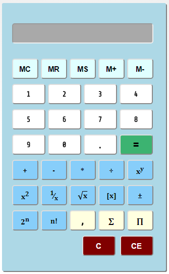

# Calculadora

Calculadora realizada utilizando HTML5, CSS3 y jQuery.

### Version
1.0.0

### Tech

Se utilizan una serie de proyectos de código abierto para su correcto funcionamiento:

* [jQuery] - evidentemente...
* [jAlert] - para las alertas 
 

[jQuery]: <http://jquery.com>
[jAlert]: <http://flwebsites.biz/jAlert/>
